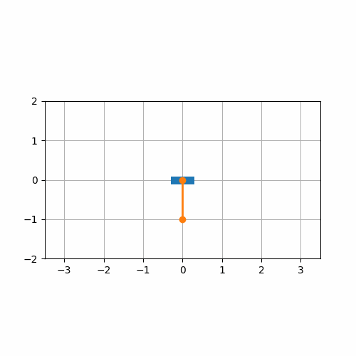

# NMPC-inverted-pendulum
Nonlinear Model predictive control

Great paper about the dynamics of the cart pole: https://sharpneat.sourceforge.io/research/cart-pole/cart-pole-equations.html

CasADi is an open-source tool for nonlinear optimization and algorithmic differentiation: https://web.casadi.org/

Swing Up example:
